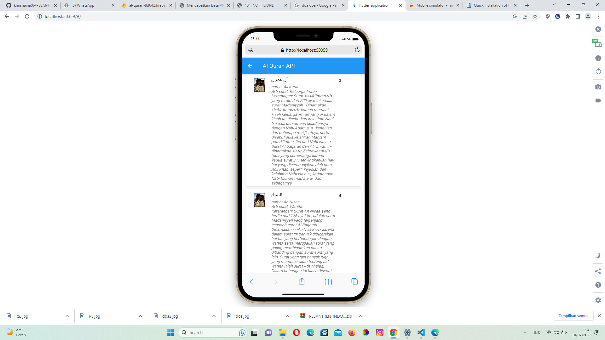
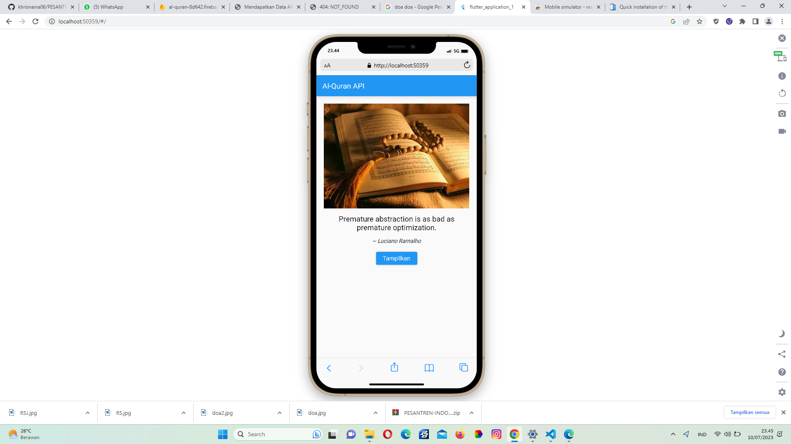
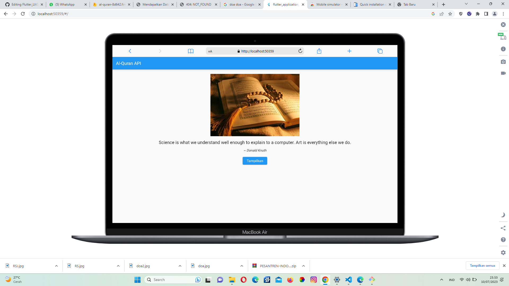

# DAFTAR API LOKAL INDONESIA

A new Flutter project.

## Getting Started

---

---

### Tampilan Halaman list quote




```Dart
import 'package:flutter/material.dart';
import 'package:http/http.dart' as http;
import 'dart:convert';

class ListQuote extends StatelessWidget {
  final String apiUrl =
      "https://api-pesantren-indonesia.vercel.app/pesantren/3206.json";

  const ListQuote({super.key});

  Future<List<dynamic>> _fetchListQuotes() async {
    var result = await http.get(Uri.parse(apiUrl));
    return json.decode(result.body);
  }

  @override
  Widget build(BuildContext context) {
    return Scaffold(
      appBar: AppBar(
        title: const Text('Pesantren Indonesia'),
      ),
      body: FutureBuilder<List<dynamic>>(
        future: _fetchListQuotes(),
        builder: (BuildContext context, AsyncSnapshot snapshot) {
          if (snapshot.hasData) {
            return ListView.builder(
              padding: const EdgeInsets.all(10),
              itemCount: snapshot.data.length,
              itemBuilder: (BuildContext context, int index) {
                var listTile = ListTile(
                  leading: Image.asset(
                    'background/oi.jpg',
                    width: 60,
                    height: 60,
                  ),
                  title: Text(
                    snapshot.data[index]['nama'],
                    textAlign: TextAlign.justify,
                  ),
                  subtitle: Column(
                    crossAxisAlignment: CrossAxisAlignment.start,
                    children: [
                      Text(
                        "Alamat: " + snapshot.data[index]['alamat'],
                        style: const TextStyle(fontStyle: FontStyle.italic),
                      ),
                      Text(
                        "Nspp: " + snapshot.data[index]['nspp'],
                        style: const TextStyle(fontStyle: FontStyle.italic),
                      ),
                      Text(
                        "Nama Kyai: " + snapshot.data[index]['kyai'],
                        style: const TextStyle(fontStyle: FontStyle.italic),
                      ),
                    ],
                  ),
                  trailing: SizedBox(
                    width: 60,
                    child: Row(
                      children: [
                        Text(snapshot.data[index]['id'].toString()),
                      ],
                    ),
                  ),
                );
                return Card(
                  child: listTile,
                );
              },
            );
          } else {
            return const Center(child: CircularProgressIndicator());
          }
        },
      ),
    );
  }
}
```

#### `ListQuote` adalah sebuah widget Flutter yang menampilkan daftar kutipan yang diambil dari sebuah API. Berikut penjelasan singkat mengenai implementasinya:

1. Kelas ini mengimpor dependensi yang diperlukan dari framework Flutter dan paket `http` untuk melakukan permintaan HTTP, serta paket `dart:convert` untuk mendecode JSON.
2. Kelas `ListQuote` merupakan turunan dari `StatelessWidget`, yang menandakan bahwa tidak ada state yang dapat berubah di dalamnya.
3. Variabel `apiUrl` berisi URL dari endpoint API tempat kutipan-kutipan diambil.
4. Widget `ListQuote` didefinisikan dengan sebuah konstruktor bernama dan sebuah parameter `key` yang wajib.
5. Fungsi `_fetchListQuotes()` adalah sebuah metode asinkron yang mengirimkan permintaan HTTP GET ke endpoint API yang ditentukan oleh `apiUrl` dan mengembalikan `Future` berisi daftar kutipan.
6. Metode `build()` mengganti metode yang sesuai dari kelas `StatelessWidget` dan membangun UI dari widget ini.
7. UI terdiri dari sebuah `Scaffold` dengan `AppBar` dan `body` yang berisi sebuah `FutureBuilder`.
8. `FutureBuilder` menampilkan komponen UI yang berbeda berdasarkan status dari future yang dikembalikan oleh `_fetchListQuotes()`.
9. Jika future telah selesai dan berisi data, maka `ListView.builder` akan ditampilkan dengan sebuah `Card` untuk setiap kutipan.
10. Setiap `Card` berisi sebuah `ListTile` dengan gambar, judul, subjudul, dan teks penutup yang menampilkan informasi tentang kutipan tersebut.
11. Jika future belum selesai, maka `CircularProgressIndicator` akan ditampilkan di tengah layar.
12. Widget ini dapat digunakan untuk mengambil dan menampilkan daftar kutipan dari API yang ditentukan dengan menambahkannya ke dalam pohon widget aplikasi.

---

---

### Tampilan halaman random quote




```Dart
import 'package:flutter/material.dart';
import 'package:http/http.dart' as http;
import 'listquote.dart';
import 'dart:convert';

class RandomQuote extends StatelessWidget {
  final String apiUrl = "https://quote-api.dicoding.dev/random";

  const RandomQuote({super.key});

  Future<dynamic> _fetchRandomQuotes() async {
    var result = await http.get(Uri.parse(apiUrl));
    return json.decode(result.body);
  }

  @override
  Widget build(BuildContext context) {
    return Scaffold(
      appBar: AppBar(
        title: const Text('List Pesantren Indonesia'),
      ),
      body: FutureBuilder<dynamic>(
        future: _fetchRandomQuotes(),
        builder: (BuildContext context, AsyncSnapshot snapshot) {
          if (snapshot.hasData) {
            return Column(
              children: [
                Container(
                  padding: const EdgeInsets.all(20),
                  child: Column(
                    children: [
                      Image.asset(
                        'background/po.jpg',
                        width: 400,
                        height: 280,
                        fit: BoxFit.cover,
                      ),
                      const SizedBox(height: 16),
                      Text(
                        snapshot.data['en'],
                        style: const TextStyle(fontSize: 20),
                        textAlign: TextAlign.center,
                      ),
                      const SizedBox(height: 16),
                      Text(
                        "~ " + snapshot.data['author'],
                        style: const TextStyle(
                          fontSize: 15,
                          fontStyle: FontStyle.italic,
                        ),
                        textAlign: TextAlign.center,
                      ),
                    ],
                  ),
                ),
                Align(
                  alignment: Alignment.bottomCenter,
                  child: SizedBox(
                    width: 110,
                    height: 35,
                    child: ElevatedButton(
                      onPressed: () {
                        Navigator.push(
                          context,
                          MaterialPageRoute(
                            builder: (context) => const ListQuote(),
                          ),
                        );
                      },
                      child: const Text(
                        'Tampilkan',
                        style: TextStyle(fontSize: 16),
                      ),
                    ),
                  ),
                ),
              ],
            );
          } else {
            return const Center(child: CircularProgressIndicator());
          }
        },
      ),
    );
  }
}

```

#### `RandomQuote` adalah sebuah widget Flutter yang menampilkan sebuah kutipan acak dari sebuah API. Berikut penjelasan singkat mengenai implementasinya:

1. Kelas ini mengimpor dependensi yang diperlukan dari framework Flutter dan paket `http`, serta mengimpor widget `ListQuote` yang telah dibuat sebelumnya, dan paket `dart:convert` untuk mendecode JSON.
2. Kelas `RandomQuote` merupakan turunan dari `StatelessWidget`.
3. Variabel `apiUrl` berisi URL dari endpoint API tempat kutipan acak diambil.
4. Widget `RandomQuote` didefinisikan dengan sebuah konstruktor bernama dan sebuah parameter `key` yang wajib.
5. Fungsi `_fetchRandomQuotes()` adalah sebuah metode asinkron yang mengirimkan permintaan HTTP GET ke endpoint API yang ditentukan oleh `apiUrl` dan mengembalikan `Future` berisi kutipan acak.
6. Metode `build()` mengganti metode yang sesuai dari kelas `StatelessWidget` dan membangun UI dari widget ini.
7. UI terdiri dari sebuah `Scaffold` dengan `AppBar` dan `body` yang berisi sebuah `FutureBuilder`.
8. `FutureBuilder` menampilkan komponen UI yang berbeda berdasarkan status dari future yang dikembalikan oleh `_fetchRandomQuotes()`.
9. Jika future telah selesai dan berisi data, maka tampilan akan menampilkan gambar, kutipan, dan penulisnya.
10. Di bagian bawah tampilan, terdapat sebuah tombol "Tampilkan" yang akan mengarahkan pengguna ke halaman `ListQuote` ketika ditekan.
11. Jika future belum selesai, maka tampilan akan menampilkan `CircularProgressIndicator`.
12. Widget ini dapat digunakan untuk menampilkan sebuah kutipan acak dari API dan memberikan opsi untuk melihat daftar kutipan dengan menekan tombol "Tampilkan".

---
---

```Dart
import "randomquote.dart";
import 'package:flutter/material.dart';

void main() => runApp(const MyApp());

class MyApp extends StatelessWidget {
  const MyApp({super.key});

  // This widget is the root of your application.
  @override
  Widget build(BuildContext context) {
    return MaterialApp(
      title: 'Pesantren API',
      debugShowCheckedModeBanner: false,
      theme: ThemeData(
        primarySwatch: Colors.blue,
      ),
      home: const RandomQuote(),
    );
  }
}
```

#### `MyApp` adalah kelas utama yang menjadi root dari aplikasi Flutter. Berikut adalah penjelasan singkat mengenai implementasinya:

1. Di dalam fungsi `main()`, aplikasi dijalankan dengan menjalankan widget `MyApp`.
2. Kelas `MyApp` merupakan turunan dari `StatelessWidget`.
3. Di dalam metode `build()`, `MaterialApp` diatur dengan judul "Pesantren API", dan mode debug ditonjolkan.
4. Tema aplikasi ditentukan menggunakan `ThemeData` dengan menggunakan primarySwatch warna biru.
5. `MaterialApp` memiliki `home` yang diatur ke widget `RandomQuote`, sehingga `RandomQuote` menjadi halaman utama aplikasi.
6. Aplikasi ini memiliki tampilan utama yang menampilkan kutipan acak dari API menggunakan widget `RandomQuote`.
7. Pada tampilan utama, pengguna dapat menekan tombol "Tampilkan" untuk melihat daftar kutipan menggunakan halaman `ListQuote`.

Dengan menjalankan aplikasi ini, pengguna akan melihat kutipan acak pada tampilan utama dan dapat melihat daftar kutipan lebih lengkap dengan menavigasi ke halaman `ListQuote`.

---
